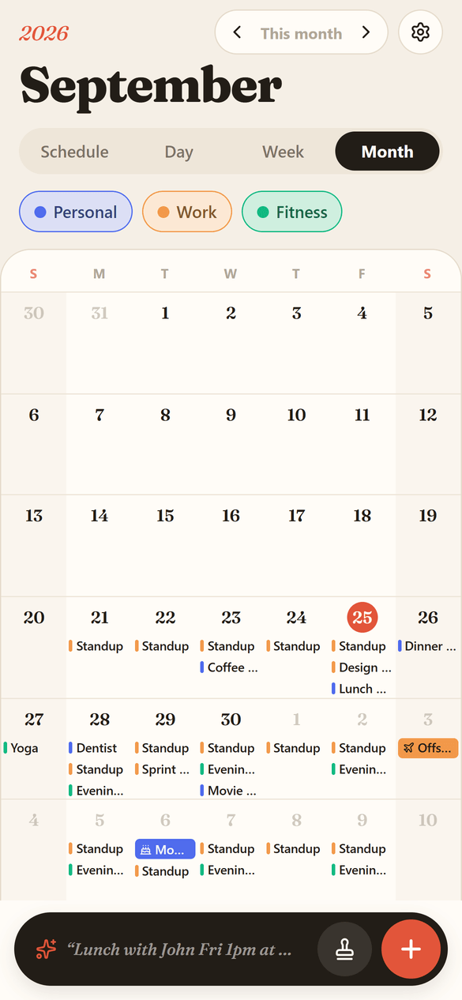
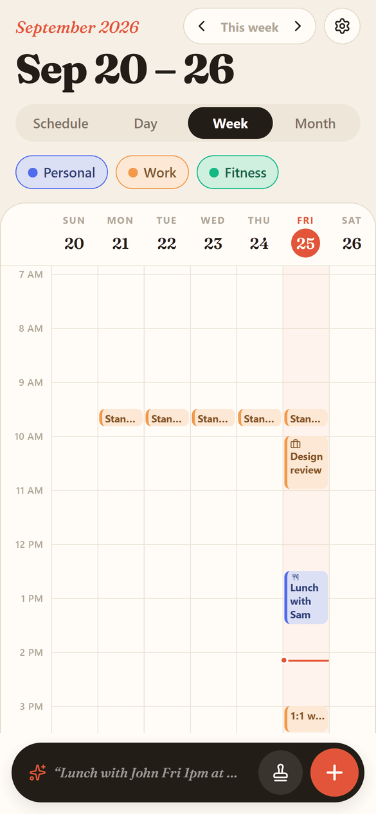
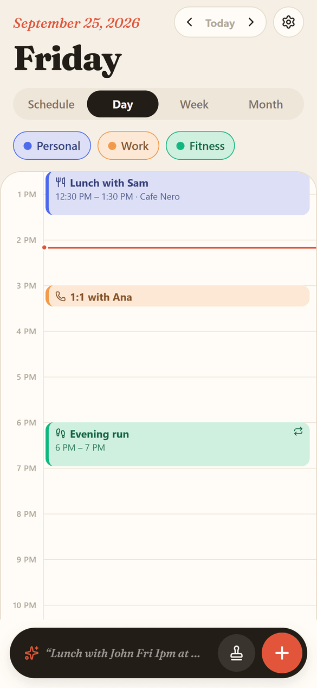
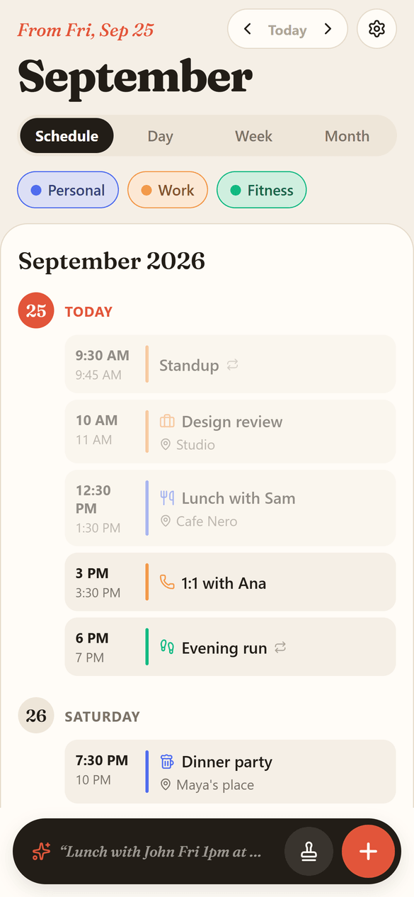
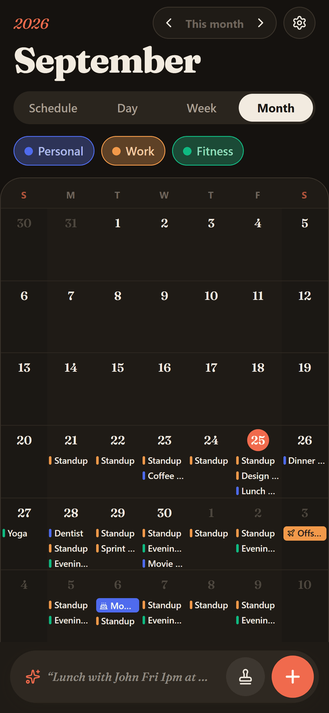
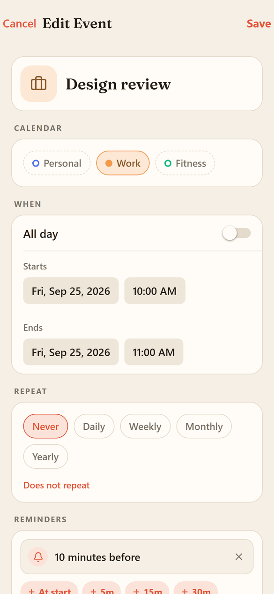

<p align="center">
  
</p>

<h1 align="center">OpenCal</h1>

<p align="center">
  A calm, local-first calendar for Android (and iOS/web) built with Expo.<br/>
  No accounts, no sync, no ads: your calendar lives on your phone.
</p>

<p align="center">
  <a href="https://github.com/BoazCohenJ/OpenCal/releases/latest"><b>Download the latest Android APK</b></a>
</p>

<p align="center">
  <b>The 45-second tour</b> (sound on): Quick Add, stamps, pausing a repeat, scheduled Do Not Disturb,<br/>
  reminders to the minute, calendar defaults and custom colors, all real footage from the app.
</p>

https://github.com/user-attachments/assets/96c68291-76bc-4ca8-a030-11c235435344

<p align="center">
  
  
  
  
</p>
<p align="center">
  
  
</p>

## Features

- **Four views:** Schedule (agenda), Day, Week and Month. Swipe left/right to move between days, weeks and months; the header tells you where you are ("Tomorrow", "In 3 weeks", "Next month").
- **Quick Add:** type "Lunch with John Fri 1pm at Cafe X" and review the parsed event before saving; go back and edit the text anytime.
- **Stamps:** save events you repeat (coffee, gym, calls) and drop them on any empty time slot in one tap, with Undo.
- **Repeating events** with pauses: skip a date range for one event or a whole calendar, and it resumes on its own.
- **Calendars with defaults:** each calendar has a color plus default reminders, repeat, location and tags that new events inherit.
- **Reminders down to the minute,** with presets and custom values; all-day reminders fire at a time you choose.
- **Quiet time and Do Not Disturb** scheduled like events (e.g. every Monday 17:00–18:00): quiet delivers reminders silently, DND skips them.
- **Day view multi-select:** long-press events, then drag them together or nudge by 15 minutes / 1 hour.
- **Colors:** 20 named swatches, a color wheel, hex input, and your own saved colors by name.
- **Icons instead of emoji** for events and stamps, **dark mode** (System / Light / Dark), smooth animations.
- **Private by design:** everything is stored locally (SQLite on device, localStorage on web).

## Install on Android

1. Open the [latest release](https://github.com/BoazCohenJ/OpenCal/releases/latest) on your phone and download the `.apk`.
2. Open it and allow installing from your browser when Android asks.
3. The app updates itself over the air: when a new version is published it shows "A new version of OpenCal is ready" with a Restart button.

Releases that change native parts of the app (icons, splash, new native modules) need a new APK from the Releases page; everything else arrives automatically.

## Development

Requirements: Node 22+ and npm.

```bash
npm install
npx expo start          # press "w" for web, or scan the QR code with a development build
npx tsc --noEmit        # typecheck
npx expo lint           # lint
```

Build an installable Android APK in the cloud with [EAS](https://docs.expo.dev/eas/):

```bash
npx eas-cli@latest build -p android --profile preview
```

Every push to `main` runs the typecheck and lint, then publishes an over-the-air update to installed preview builds (`.github/workflows/eas-update.yml`). The release rules (when a version bump and a new build are required) are documented in [AGENTS.md](AGENTS.md).

## Tech stack

- [Expo](https://expo.dev) SDK 57, React Native, TypeScript
- React Navigation (native stack)
- expo-sqlite for storage, expo-notifications for reminders, expo-updates for over-the-air updates
- rrule for recurrence, chrono-node for natural-language parsing, date-fns
- react-native-svg + lucide icons, Fraunces display font

## Project structure

```
App.tsx                 navigation, theme and providers
src/screens/            screens (calendar, editors, settings, notifications…)
src/views/              schedule, day, week and month views
src/components/         shared UI (pickers, sheets, toast, logo…)
src/context/            app state (CalendarContext)
src/services/           database, occurrences/recurrence, notifications, focus windows
src/models/             data types
scripts/make-logo.js    generates the app icon, splash and favicon
promo/                  renders the promo video from code (see promo/README.md)
```

## License

[MIT](LICENSE) © Boaz Cohen
